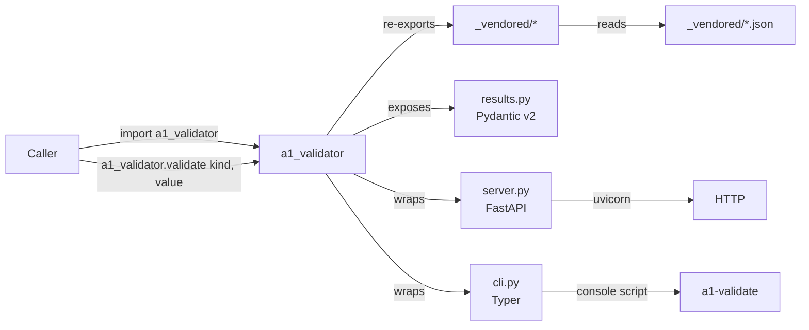

# About

## What this is

A1 Validator is a Python port of the 23 workflow validators published in
the [Armosphera/autoresearch-sboss](https://github.com/Armosphera/autoresearch-sboss)
corpus. Each validator is a faithful translation of its JS counterpart
and ships with the same vendored `eval_set.json` corpus used upstream
for regression testing.

The package is deliberately minimal: one `import a1_validator` gives you
23 validator functions, a unified `a1_validator.validate(kind, value)`
dispatcher, 23 matching Pydantic v2 result models, and an optional
FastAPI HTTP service in `a1_validator.server`. There is no global
state, no I/O at import time, and no hidden side effects.

## Architecture



* **`src/a1_validator/_vendored/`** — 23 vendored JS→Python translations
  (one file per workflow). The `_port.py` table maps public name →
  vendored module. Each module exposes a uniform `validate(input_data)`
  function (the original `run_workflow` adapter was renamed).
* **`src/a1_validator/_vendored/*.json`** — vendored reference data
  (chart-of-accounts, regions) — declared as `package_data` so the
  wheel is self-contained.
* **`src/a1_validator/__init__.py`** — re-exports each vendored
  validator as a top-level function, wires the Pydantic result models,
  exposes `a1_validator.validate(kind, value)`, `list_kinds()`, and
  `model_for(kind)`.
* **`src/a1_validator/results.py`** — 23 Pydantic v2 result models
  (`HHVHResult`, `INNResult`, …) with `extra="allow"` so downstream
  consumers can ignore fields they don't use.
* **`src/a1_validator/cli.py`** — Typer-based `a1-validate` console
  script (validate, list, batch, serve, --version).
* **`src/a1_validator/server.py`** — FastAPI app exposing 23 explicit
  `POST /validate/<kind>` + 23 `POST /batch/<kind>` routes (one pair per
  validator) so the OpenAPI schema reads cleanly. Boot with
  `a1-validate serve` or `uvicorn a1_validator.server:app`.
* **`scripts/_vendor.py`** — reproducible vendor script. Re-run after
  pulling upstream to refresh `_vendored/` against a new
  `autoresearch-sboss` commit. Renames `run_workflow` → `validate` and
  rewrites `data.json` paths to the package-relative layout.

## Test coverage

The pytest suite has 440 cases (409 from vendored eval-sets, 31 from
in-tree tests for CLI / HTTP / dispatcher / result models). The CI gate
is `--cov-fail-under=80` — see `.github/workflows/ci.yml`. Coverage is
uploaded to Codecov on the `3.12` matrix job when `CODECOV_TOKEN` is
present in repo secrets.

Run locally:

```bash
pip install -e ".[server]"
pip install pytest pytest-cov
pytest tests/ -v --cov=a1_validator --cov-report=term-missing
```

## Upstream corpus

This port tracks the
[autoresearch-sboss](https://github.com/Armosphera/autoresearch-sboss)
corpus at commit `6c9a9149f1dc8b7a5430d542de19f564a078418c`. To pick
up new validators from upstream:

1. Pull the new commit in `autoresearch-sboss`.
2. Run `python scripts/_vendor.py --upstream-commit <sha>`.
3. Update `tests/_eval_sets/` with any new `eval_set.json` files.
4. Add the new validator to `_port._VALIDATORS`.
5. Add a Pydantic result model in `results.py` (one line if the shape
   is `{"ok": bool, ...}`; a few lines otherwise).
6. Re-run the full pytest suite — the vendored eval-set cases will
   catch any translation drift.

## Why a port?

The upstream `autoresearch-sboss` validators are JS modules with a
`run_workflow` adapter — designed for a Node eval harness, awkward to
embed inside a Python SBOSS finance stack. The Python port:

* exposes a uniform `validate(input_data) -> dict` contract on every
  validator, with the same vendored `eval_set.json` corpus used for
  regression testing;
* surfaces 23 typed Pydantic v2 result models for typed consumers
  (`model_validate(result)` returns a `HHVHResult(ok=True, ...)`);
* packages everything as a single importable wheel (`pip install
  a1-validator`) with no JS runtime, no Node toolchain, and no
  network round-trip at import time;
* keeps the vendored source diffable against upstream — the
  `_vendor.py` script does a one-shot rename (`run_workflow` →
  `validate`) and a path rewrite; everything else is unchanged.

## License

MIT — same as the upstream
[autoresearch-sboss](https://github.com/Armosphera/autoresearch-sboss)
corpus. Vendor source: commit `6c9a9149f1dc8b7a5430d542de19f564a078418c`.

## Repository

* **Source**: [github.com/Armosphera/A1-Validator](https://github.com/Armosphera/A1-Validator)
* **Upstream**: [github.com/Armosphera/autoresearch-sboss](https://github.com/Armosphera/autoresearch-sboss)
